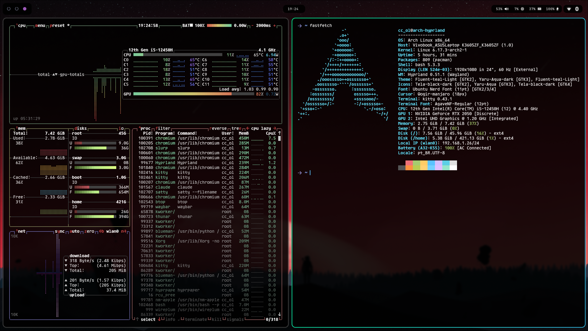

# Hyprland Dotfiles

Custom Hyprland Wayland compositor configuration for Arch Linux.

## Screenshots


*Desktop with btop, fastfetch and system monitoring*


*Wofi launcher and file manager*

## Components

This repository contains configurations for:

- **Hyprland** - Dynamic tiling Wayland compositor
- **Hyprlock** - Lockscreen with clean white theme and auto-lock after 3 minutes
- **Hypridle** - Idle management daemon
- **Waybar** - Highly customizable status bar
- **Kitty** - Fast and modern terminal emulator with custom theme
- **Bash** - Custom .bashrc with modern prompt, git integration and aliases
- **Wofi** - Application launcher for Wayland
- **Dunst** - Notification daemon
- **Fonts** - Font configuration (Ubuntu Nerd Font and JetBrainsMono Nerd Font)
- **SDDM** - Customized Astronaut theme

## Prerequisites

Before installing, make sure you have the following packages installed:

```bash
sudo pacman -S hyprland waybar kitty wofi hyprpaper dunst sddm hyprlock hypridle
yay -S ttf-ubuntu-nerd ttf-jetbrains-mono-nerd
```

## Installation

### 1. Clone the repository

```bash
git clone https://github.com/cleitondeoliveira/hyprland-dotfiles.git
cd hyprland-dotfiles
```

### 2. Run the installation script

```bash
./install.sh
```

The script will:
- Automatically backup your current configurations
- Install the new configurations in `~/.config/`
- Make scripts executable

### 3. Restart Hyprland

Press `Super+Shift+E` and login again, or run:

```bash
hyprctl reload
```

## Repository Structure

```
.
├── .config/
│   ├── hypr/
│   │   ├── hyprland.conf      # Main Hyprland configuration
│   │   ├── hyprpaper.conf     # Wallpaper configuration
│   │   ├── hyprlock.conf      # Lockscreen configuration
│   │   ├── hypridle.conf      # Idle management (auto-lock)
│   │   └── autostart.conf     # Apps that start automatically
│   ├── waybar/
│   │   ├── config.jsonc       # Waybar configuration
│   │   ├── style.css          # Waybar styles
│   │   └── scripts/
│   │       └── power-menu.sh  # Power menu
│   ├── kitty/
│   │   └── kitty.conf         # Terminal configuration
│   ├── wofi/
│   │   ├── config             # Wofi configuration
│   │   └── style.css          # Wofi styles
├── .bashrc                     # Bash configuration with custom prompt
│   ├── dunst/
│   │   └── dunstrc            # Notification configuration
│   ├── fontconfig/
│   │   └── fonts.conf         # Font configuration
│   └── xsettingsd/
│       └── xsettingsd.conf    # GTK configuration
├── sddm/
│   ├── astronaut/             # SDDM theme customizations
│   ├── install-sddm.sh        # SDDM installation script
│   └── sddm.conf.d/           # SDDM configuration
├── install.sh                  # Installation script
└── README.md                   # This file
```

## Key Bindings

Check the `.config/hypr/hyprland.conf` file to see all configured keybindings.

Some common shortcuts:
- `Super + Q` - Close window
- `Super + T` - Open terminal
- `Super + E` - Open file manager
- `Super + R` - Open launcher
- `Super + F` - Fullscreen mode
- `Super + Escape` - Power menu (Lock/Logout/Restart/Shutdown)
- `Super + Shift + E` - Exit Hyprland

## Customization

Feel free to modify the configurations according to your preferences:

- **Colors and themes**: Edit CSS files in waybar and wofi
- **Keybindings**: Modify `hypr/hyprland.conf`
- **Wallpaper**: Change in `hypr/hyprpaper.conf`
- **Lockscreen**: Customize in `hypr/hyprlock.conf`
- **Auto-lock timing**: Adjust in `hypr/hypridle.conf` (default: 3 minutes)
- **Terminal**: Configure in `kitty/kitty.conf`
- **Shell prompt**: Customize in `.bashrc` (includes git status, aliases, and functions)

## Backup

The installation script automatically creates backups in:
```
~/.config-backup-YYYYMMDD-HHMMSS/
```

To restore a backup:
```bash
cp -r ~/.config-backup-YYYYMMDD-HHMMSS/* ~/.config/
```

## SDDM Theme

This repository includes custom configurations for the **SDDM Astronaut** theme.

To install the SDDM theme (requires root):
```bash
cd sddm
sudo ./install-sddm.sh
```

### Credits
- **SDDM Astronaut Theme** by [Keyitdev](https://github.com/Keyitdev/sddm-astronaut-theme)

## Contributing

Contributions are welcome! Feel free to:
- Report bugs
- Suggest improvements
- Submit pull requests

## License

MIT License - Feel free to use and modify.
